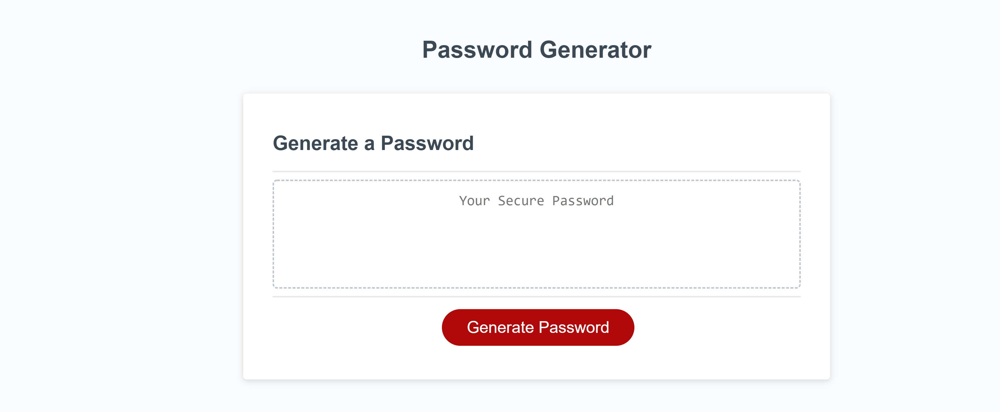
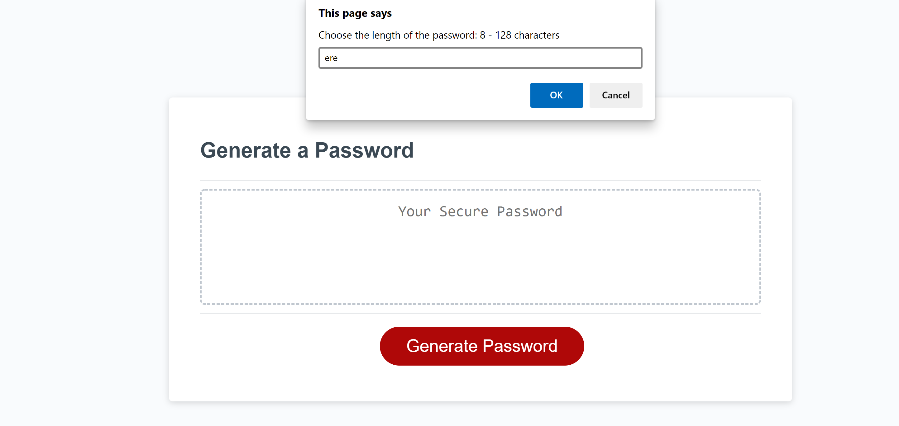
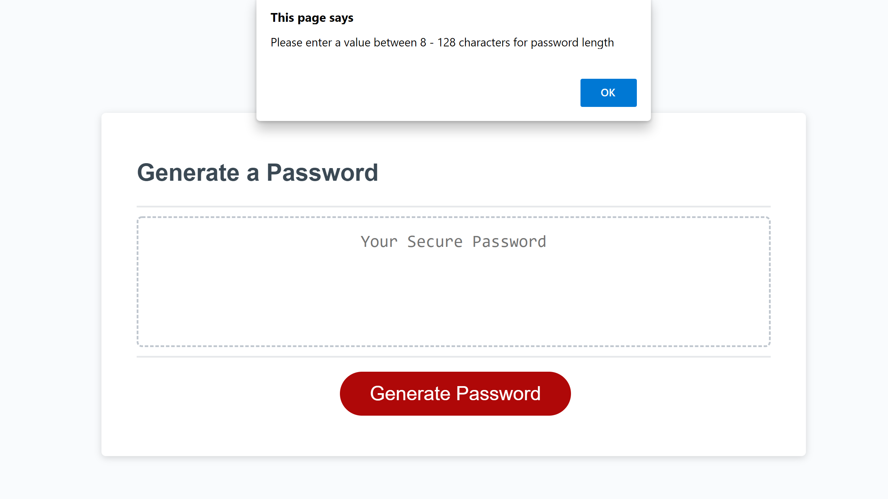
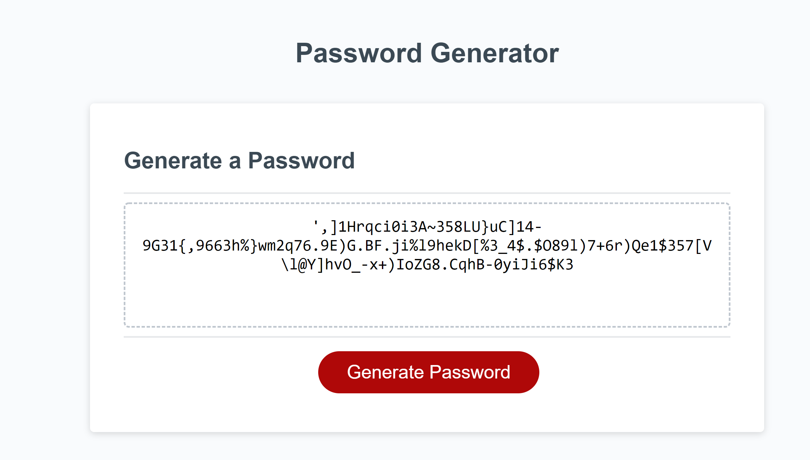

# HW03-Password Generator
# Overview

Using the starter code I have tried to build an application that generates a random password based on the user's choice. The user is asked to pick the length of the password which should be between 8 -128 characters and any one or a combination of characters to generate a unique password. 

The user is asked a question using prompts. The application validates user input. It checks for only numeric input for the lenght as well as the range. The application also expects at least one type of character to generate a unique password.

Screen shots:
1. 
2. 
3. 
4. 
5. 

1. ![Deployed application]: https://chaitra-srinivas.github.io/
2. ![Github link]: https://github.com/chaitra-srinivas/HW03-Password-Generator
